# 놀러온나 데이터베이스 ERD

이 문서는 현재 Alembic 리셋 체인(`0001` → `0008`) 기준 MVP 스키마를 설명합니다.
과거 `SPOTS_CORE`, `GOOD_PRICE_*`, 혼잡도/임베딩 상세 테이블 설계는 legacy 설계 기록이며,
현재 마이그레이션에는 포함되어 있지 않습니다.

## 도메인 구성

| 도메인 | 테이블 | 책임 |
| --- | --- | --- |
| 사용자 | `users` | 소셜 로그인 사용자 |
| 스팟 | `spots`, `spot_details`, `spots_raw_snapshots`, `spot_images` | TourAPI 관광지/문화시설/레포츠/음식점 |
| 공식 여행코스 | `travel_courses`, `travel_course_raw_snapshots`, `course_items` | TourAPI 공식 코스 마스터 |
| 생성 코스 | `generated_courses`, `generated_course_items`, `course_decisions` | 사용자가 저장/공유하는 추천 코스 |
| 음식/가격 | `fd_food_places`, `fd_food_place_sources`, `fd_food_place_menus`, `fd_food_price_observations`, `fd_food_place_spot_matches`, `sp_spot_price_summary` | 가성비 음식 장소와 메뉴 가격 |
| 지역 코드 | `ldong_codes` | 부산 16개 법정동 시군구 코드 |
| 운영 | `sync_logs` | 파이프라인 실행 이력 |

## 핵심 원칙

- TourAPI `contentid`는 내부 ID가 아니라 원천 자연키이므로 `VARCHAR(20)`로 저장합니다.
- 서비스 테이블은 `public`, 임베딩/벡터용 스키마는 `vectors`를 사용합니다.
- 원천 API의 생성/수정 시각은 `source_created_at`, `source_modified_time`처럼 별도 명칭을 씁니다.
- 앱 내부 감사 컬럼은 `created_at`, `created_by`, `updated_at`, `updated_by`, `deleted_at`, `deleted_by`를 씁니다.
- `fd_food_places`는 여러 가격/음식 원천을 공통 모델로 통합하고, 필요할 때 `spots`와 매칭합니다.
- `sp_spot_price_summary`는 추천 조회 최적화 캐시이며 source of truth가 아닙니다.

## Mermaid ERD

```mermaid
erDiagram
    USERS {
        bigserial id PK
        varchar external_id
        varchar provider
        varchar email
        varchar nickname
        text profile_image_url
        varchar role
        timestamptz created_at
        varchar created_by
        timestamptz updated_at
        varchar updated_by
        timestamptz last_active_at
        timestamptz deleted_at
        varchar deleted_by
    }

    SPOTS {
        varchar content_id PK
        varchar content_type_id
        varchar title
        boolean source_tour_api
        boolean source_busan_food
        numeric map_x
        numeric map_y
        geography geog
        varchar l_dong_regn_cd
        varchar l_dong_signgu_cd
        varchar lcls_systm_1
        varchar lcls_systm_2
        varchar lcls_systm_3
        text first_image
        text first_image2
        varchar first_image_cpyrht_div_cd
        timestamptz source_modified_time
        timestamptz synced_at
        timestamptz updated_at
        boolean is_active
        timestamptz inactive_since
    }

    SPOT_DETAILS {
        varchar content_id PK,FK
        varchar tel
        varchar tel_name
        text homepage
        text addr1
        text addr2
        varchar zipcode
        text overview
        varchar overview_hash
        jsonb intro
        boolean parking_available
        timestamptz source_created_at
        timestamptz updated_at
    }

    SPOTS_RAW_SNAPSHOTS {
        varchar content_id PK,FK
        jsonb raw_json
        timestamptz fetched_at
        timestamptz updated_at
    }

    SPOT_IMAGES {
        bigserial id PK
        varchar content_id FK
        text origin_img_url
        text small_img_url
        varchar img_name
        varchar cpyrht_div_cd
        varchar serial_num
    }

    TRAVEL_COURSES {
        varchar content_id PK
        varchar title
        text overview
        varchar overview_hash
        varchar theme
        varchar taketime
        integer taketime_minutes
        varchar distance
        numeric distance_km
        text schedule
        varchar infocenter_tourcourse
        text first_image
        varchar first_image_cpyrht_div_cd
        varchar l_dong_regn_cd
        timestamptz source_modified_time
        timestamptz source_created_at
        timestamptz synced_at
        timestamptz updated_at
        boolean is_active
        timestamptz inactive_since
    }

    TRAVEL_COURSE_RAW_SNAPSHOTS {
        varchar content_id PK,FK
        jsonb raw_json
        timestamptz fetched_at
        timestamptz updated_at
    }

    COURSE_ITEMS {
        bigserial id PK
        varchar course_content_id FK
        integer serial_num
        varchar sub_content_id
        varchar matched_spot_id FK
        varchar sub_name
        text sub_overview
        text sub_image
        varchar sub_image_alt
    }

    GENERATED_COURSES {
        bigserial id PK
        bigint user_id FK
        bigint parent_course_id FK
        uuid pair_id
        varchar weight_profile
        varchar title
        varchar input_signgu
        integer input_budget
        varchar input_duration
        varchar input_companion
        text_array input_mood
        varchar generation_mode
        varchar generation_method
        integer total_cost
        integer total_minutes
        integer total_savings
        varchar compared_with_travel_course_id FK
        jsonb weather_at_gen
        boolean is_public
        varchar share_token
        integer view_count
        timestamptz created_at
        varchar created_by
        timestamptz updated_at
        varchar updated_by
        timestamptz deleted_at
        varchar deleted_by
    }

    GENERATED_COURSE_ITEMS {
        bigserial id PK
        bigint course_id FK
        smallint serial_num
        varchar spot_content_id FK
        time arrival_time
        smallint duration_minutes
        integer expected_cost
        smallint travel_minutes_from_prev
        text notes
        timestamptz created_at
        varchar created_by
        timestamptz updated_at
        varchar updated_by
    }

    COURSE_DECISIONS {
        bigserial id PK
        bigint course_id FK
        varchar decision_type
        varchar severity
        varchar spot_content_id FK
        varchar replacement_spot_id FK
        text reason
        text user_message
        jsonb evidence
        timestamptz created_at
        varchar created_by
    }

    FOOD_PLACES {
        bigserial id PK
        varchar name
        varchar business_category
        varchar normalized_category
        boolean is_course_food_candidate
        text address
        varchar tel
        varchar business_hours_raw
        text description
        varchar representative_menu
        boolean delivery_available
        boolean parking_available
        varchar source_region
        numeric map_x
        numeric map_y
        geography geog
        boolean is_active
        timestamptz inactive_since
        timestamptz created_at
        varchar created_by
        timestamptz updated_at
        varchar updated_by
    }

    FOOD_PLACE_SOURCES {
        bigserial id PK
        bigint food_place_id FK
        varchar source
        varchar external_id
        varchar source_region
        jsonb raw_json
        timestamptz fetched_at
        timestamptz created_at
    }

    FOOD_PLACE_MENUS {
        bigserial id PK
        bigint food_place_id FK
        varchar menu_name
        integer price
        varchar currency
        smallint display_order
        varchar source
        boolean is_representative
        timestamptz last_observed_at
        timestamptz created_at
        varchar created_by
        timestamptz updated_at
        varchar updated_by
    }

    FOOD_PRICE_OBSERVATIONS {
        bigserial id PK
        bigint food_place_id FK
        varchar menu_name
        integer observed_price
        varchar currency
        smallint display_order
        varchar source_type
        varchar source
        jsonb raw_payload
        timestamptz observed_at
        varchar review_status
        bigint reviewed_by FK
        timestamptz reviewed_at
        text reviewer_note
        timestamptz created_at
        varchar created_by
    }

    FOOD_PLACE_SPOT_MATCHES {
        bigserial id PK
        bigint food_place_id FK
        varchar spot_content_id FK
        numeric match_score
        varchar match_status
        varchar match_method
        bigint reviewed_by FK
        timestamptz reviewed_at
        text reviewer_note
        timestamptz created_at
        varchar created_by
        timestamptz updated_at
        varchar updated_by
    }

    SPOT_PRICE_SUMMARY {
        varchar spot_content_id PK,FK
        integer min_price
        integer avg_price
        varchar representative_menu_name
        integer representative_price
        integer menu_count
        integer source_count
        timestamptz updated_at
    }

    SYNC_LOGS {
        bigserial id PK
        varchar job_name
        varchar run_type
        varchar status
        bigint triggered_by FK
        bigint parent_run_id FK
        timestamptz started_at
        timestamptz ended_at
        integer duration_seconds
        integer api_calls_used
        integer records_fetched
        integer records_upserted
        integer records_failed
        text error_message
        jsonb metadata
    }

    LDONG_CODES {
        varchar regn_cd PK
        varchar signgu_cd PK
        varchar name
    }

    USERS ||--o{ GENERATED_COURSES : saves
    USERS ||--o{ SYNC_LOGS : triggers
    USERS ||--o{ FOOD_PRICE_OBSERVATIONS : reviews
    USERS ||--o{ FOOD_PLACE_SPOT_MATCHES : reviews
    SPOTS ||--|| SPOT_DETAILS : details
    SPOTS ||--|| SPOTS_RAW_SNAPSHOTS : raw
    SPOTS ||--o{ SPOT_IMAGES : images
    SPOTS ||--o{ COURSE_ITEMS : matched
    SPOTS ||--o{ GENERATED_COURSE_ITEMS : visits
    SPOTS ||--o{ COURSE_DECISIONS : decisions
    SPOTS ||--|| SPOT_PRICE_SUMMARY : price_cache
    TRAVEL_COURSES ||--|| TRAVEL_COURSE_RAW_SNAPSHOTS : raw
    TRAVEL_COURSES ||--o{ COURSE_ITEMS : items
    TRAVEL_COURSES ||--o{ GENERATED_COURSES : compared_with
    GENERATED_COURSES ||--o{ GENERATED_COURSE_ITEMS : items
    GENERATED_COURSES ||--o{ COURSE_DECISIONS : decisions
    GENERATED_COURSES ||--o{ GENERATED_COURSES : parent
    FOOD_PLACES ||--o{ FOOD_PLACE_SOURCES : sources
    FOOD_PLACES ||--o{ FOOD_PLACE_MENUS : menus
    FOOD_PLACES ||--o{ FOOD_PRICE_OBSERVATIONS : observations
    FOOD_PLACES ||--o{ FOOD_PLACE_SPOT_MATCHES : matches
    SPOTS ||--o{ FOOD_PLACE_SPOT_MATCHES : matched_spot
    SYNC_LOGS ||--o{ SYNC_LOGS : parent
```

## 후속 설계 후보

- 혼잡도 forecast/cache 도메인
- 임베딩 테이블 및 HNSW 인덱스
- 행사 도메인
- 북마크/리뷰/방문 이력 도메인
- 날씨/대기질 캐시
